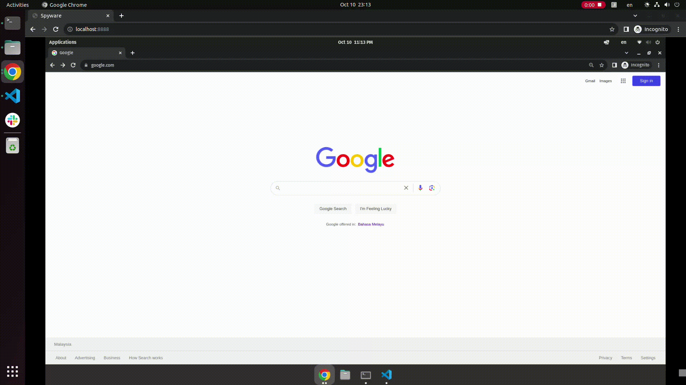

# <p align="center">RSPY</p>

<p align="center">
RSPY is a web-based remote control application that allows you to control your desktop remotely. With RSPY, you can capture desktop snapshots and expose them via WebSocket, enabling seamless interaction with your desktop from any device with a web browser.
</p>


<hr />

## Features
- <b>Desktop Snapshot:</b> Capture real-time desktop snapshots and display them on your web browser.
- <b>Mouse Interaction:</b> Control your desktop using your mouse, enabling precise navigation and interaction.
- <b>Keyboard Support:</b> Send keyboard inputs remotely, allowing you to type and execute commands on your desktop remotely.


## How It Works
RSPY utilizes WebSocket technology to establish a real-time connection between your desktop and the web client. Through this connection, desktop snapshots are captured and sent to the client, providing a live view of your desktop. Mouse and keyboard interactions are transmitted back to the server, enabling seamless control of your desktop from the web browser.

## Installation
1. Clone the Repository:
    ```bash
    git clone https://github.com/dev6699/rspy.git
    cd rspy
    ```

2. Install Dependencies:
    ```bash
    go mod tidy
    ```

3. Start the Server on remote desktop:
    ```bash
    go run main.go
    ```
    **Available options:**
    ```bash
    -i string
        Interval between screenshot capture. Examples: [100ms, 1s, 1m, 1h] (default "100ms")
    -q int
        Quality of screenshot, ranges from 1 to 100 inclusive, higher is better (default 80)
    ```
    Sample usage with `1 second interval` and `100 quality`:
    ```bash
    go run main.go -i 1s -q 100
    ```

4. Access the Web Interface:

    Open your web browser and navigate to `http://<remote_ip>:8888` to start controlling your desktop remotely.

## Usage
1. Open the RSPY web interface in your browser.
2. Connect to your desktop by entering the appropriate server details.
3. Use your mouse and keyboard to interact with your desktop remotely.
4. Enjoy the seamless remote control experience provided by RSPY!

## Contributing
We welcome contributions from the community. If you have suggestions, feature requests, or bug reports, please open an issue or submit a pull request. Let's make RSPY even better together!

## License
This project is licensed under the MIT License - see the [LICENSE](LICENSE) file for details.

<hr>
Note: This project is still under active development. Please report any issues you encounter, and feel free to contribute to the project's improvement. Thank you for using RSPY!